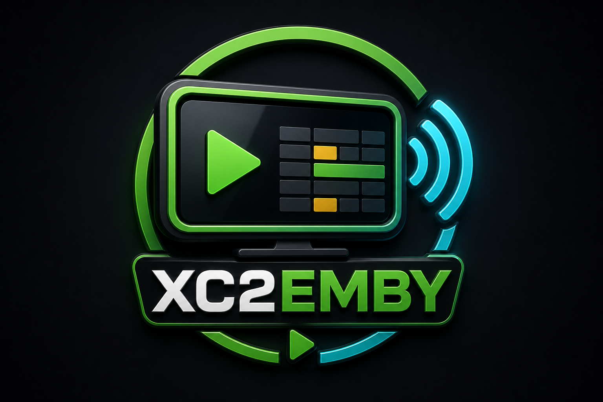
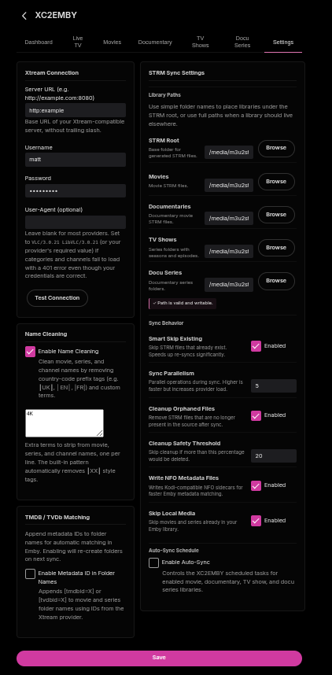
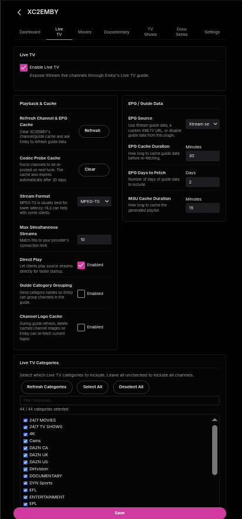
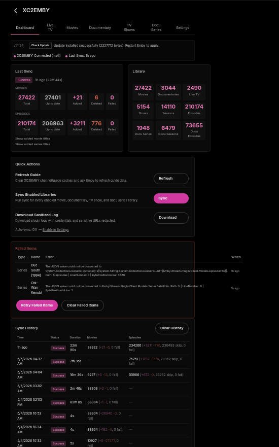

<p align="center">
  
</p>

<h1 align="center">XC2EMBY</h1>

<p align="center">
  An Emby Server plugin that connects directly to any Xtream-compatible IPTV provider.<br/>
  Live TV with guide data, background codec detection, VOD movie/documentary sync, and TV/docu-series sync — all from one config page.
</p>

<p align="center">
  
  
  
</p>

---

## Table of Contents

- [Features Overview](#features-overview)
- [Installation](#installation)
- [Configuration Guide](#configuration-guide)
  - [Settings Tab](#settings-tab)
  - [Live TV Tab](#live-tv-tab)
  - [Movies Tab](#movies-tab)
  - [Documentary Tab](#documentary-tab)
  - [TV Shows Tab](#tv-shows-tab)
  - [Docu Series Tab](#docu-series-tab)
- [Dashboard](#dashboard)
- [Auto-Sync](#auto-sync)
- [Channel Name Cleaning](#channel-name-cleaning)
- [Codec Detection & OSD Display](#codec-detection--osd-display)
- [Folder Modes](#folder-modes)
- [Metadata & NFO Files](#metadata--nfo-files)
- [Local Media Filtering](#local-media-filtering)
- [Orphan Cleanup](#orphan-cleanup)
- [Update Checker](#update-checker)
- [Development & Releases](#development--releases)
- [Configuration Reference](#configuration-reference)
- [Credits](#credits)

---

## Features Overview

### Current Release: v1.1.25

**v1.1.25**
- Fixed series sync failure when provider returns `episodes` as an empty array `[]` instead of an object (e.g. Due South).
- Fixed series sync failure when provider returns no detail data (empty array, null, or false) for a series (e.g. Obi-Wan Kenobi). Both cases are now skipped gracefully instead of appearing as failed items.

**v1.1.24**
- Version bump.

**v1.1.23**
- Refreshed the Dashboard, Settings, and Live TV tabs with clearer row-based controls and improved layout.
- Added Dashboard and Live TV guide refresh actions for clearing XC2EMBY channel/guide caches and triggering Emby guide refresh.
- Added optional Live TV channel-logo cache cleanup during guide refresh.
- Added a new XC2EMBY plugin logo for Emby and the README.
- Fixed provider parsing for mixed numeric/string `added` timestamps in live and VOD stream data — previously caused a complete channel list failure when any channel had a non-numeric value.

### Live TV
- Registers as a native Emby tuner host — channels appear in Live TV just like any other tuner
- Fetches channel list from Xtream `get_live_streams` API with a 6-hour warm cache and background refresh
- Supports `ts` (MPEG-TS) and `m3u8` (HLS) stream output formats
- Optional **direct play** — clients connect straight to the Xtream URL, bypassing Emby's transcoder entirely
- Filters channels by category and optionally excludes adult content
- Optionally adds category names as M3U `group-title` tags
- Optional guide refresh action clears cached channel logos so Emby can re-fetch current artwork

### Guide Data (EPG)
- Registered as a native Emby `IListingsProvider` — guide data flows through Emby's standard Live TV pipeline
- Three guide modes: **Xtream server** XMLTV, **custom XMLTV URL**, or **disabled**
- Full XMLTV document cached in memory with configurable TTL
- Full XMLTV field passthrough: sub-title, categories, production year, content rating, icon/poster, live/new/repeat/premiere flags, and season/episode numbers (xmltv_ns or onscreen format)
- Each program gets a unique `ShowId` scoped to its channel, preventing Emby from showing irrelevant "Other Showings" across unrelated channels

### Codec Detection & OSD Display
- Runs `ffprobe` in the background on first tune to detect video codec, resolution, and audio codec
- Results cached per stream (persisted across restarts, 30-day TTL)
- On subsequent tunes, Emby skips its own probe entirely — codec and resolution appear in the player OSD immediately
- Video display: `H264 1080p`, `HEVC 4K`, etc. Audio display: `AC3 5.1`, `AAC stereo`, etc.

### VOD Movies
- Syncs Xtream VOD catalog into `.strm` files for Emby library scanning
- Two folder layout modes in the UI: single folder or custom multi-folder category mapping
- Smart delta sync — only processes items added since the last run
- Optional **Skip Local Media** filter skips XC items already present in your Emby library
- Optional TMDb folder naming (`Movie Title [tmdbid=123]`) with fallback lookup through Emby
- Optional Kodi-compatible `.nfo` sidecar files
- **Stop Sync** can cancel an active STRM write
- One-click deletion of all synced content from the Movies tab

### Documentary Movies
- Uses the same VOD movie sync engine as Movies, with its own enable switch, category selection, folder mappings, root folder, delete action, and delta timestamp
- Lets you dedicate documentary provider groups to a separate Emby library path such as `Documentaries`

### TV Shows
- Syncs Xtream series into `Show/Season XX/Episode.strm` folder structure
- Same folder modes as movies, plus TVDb/TMDb folder naming
- Episode hash detection skips unchanged series even when the provider bumps timestamps
- TVDb ID manual overrides per series name
- Optional TVDb and TMDB fallback lookups through Emby's provider stack
- Optional `tvshow.nfo` sidecar files
- **Stop Sync** can cancel an active STRM write

### Docu Series
- Uses the same series sync engine as TV Shows, with separate enable switch, category selection, folder mappings, root folder, delete action, delta timestamp, and episode hash cache
- Lets documentary series live in their own root folder such as `Docu Series`

### Dashboard & Administration
- Built-in dashboard: sync history (last 10 runs), live progress, library stats, auto-sync schedule
- Quick actions for guide refresh, enabled-library sync, and sanitized log download
- Real-time progress bars for running syncs
- Retry failed items from the last sync
- Sanitized log download (credentials redacted)
- Config page uses Emby's active theme accent color throughout — adapts automatically when you change your Emby theme

---

## Installation

### Step 1 - Get the DLL

**Option A: Download a release**

Download `XC2EMBY.Plugin.dll` from the [latest release](../../releases/latest). Only the DLL is needed.

**Option B: Build from source**

Requires .NET SDK 8.0+. The plugin targets .NET Standard 2.0 for Emby compatibility.

```bash
git clone https://github.com/sftech13/EMBY-XC.git
cd EMBY-XC
dotnet build Emby.Xtream.Plugin/Emby.Xtream.Plugin.csproj -c Release
# Output: artifacts/bin/Release/netstandard2.0/XC2EMBY.Plugin.dll
```

For a deployable release-style build:

```bash
dotnet publish Emby.Xtream.Plugin/Emby.Xtream.Plugin.csproj -c Release -o artifacts/publish --no-self-contained
# Output: artifacts/publish/XC2EMBY.Plugin.dll
```

### Step 2 - Install

Copy the DLL to your Emby plugins directory and restart Emby.

**Linux (systemd)**
```bash
sudo cp XC2EMBY.Plugin.dll /var/lib/emby/plugins/
sudo systemctl restart emby-server
```

**Docker**
```bash
docker cp XC2EMBY.Plugin.dll emby:/config/plugins/
docker restart emby
```

### Step 3 - Open the Config Page

Go to **Emby Dashboard → Plugins → XC2EMBY** to open the configuration page.

### Updating

Download the new DLL from [Releases](../../releases/latest), replace the existing file, and restart Emby. Or use the built-in **Update Checker** on the Dashboard tab.

---

## Configuration Guide

The config page tabs are ordered as: **Dashboard**, **Live TV**, **Movies**, **Documentary**, **TV Shows**, **Docu Series**, and **Settings**.

---

### Settings Tab



#### Xtream Connection

| Field | Description |
|---|---|
| Server URL | Full URL to your Xtream server, e.g. `http://server.example.com:8080` |
| Username | Your Xtream account username |
| Password | Your Xtream account password |
| HTTP User-Agent | Optional custom `User-Agent` header sent with all provider requests |

Click **Test Connection** to verify credentials before saving.

#### STRM Library Path

The base directory where Movies, Documentaries, TV Shows, and Docu Series folders will be created. Example: `/media/xtream` -> movies go to `/media/xtream/Movies`, series go to `/media/xtream/TV Shows`.

Use the **Browse** buttons to navigate the server filesystem for the root path and each content folder field. The path is validated automatically when it changes.

Folder fields can be either:
- a folder name under the STRM library root, such as `Movies`
- a full absolute path, such as `/media/Movies`

#### Guide (EPG)

| Setting | Options | Description |
|---|---|---|
| EPG Source | Xtream Server / Custom URL / Disabled | Where to fetch guide data from |
| Custom XMLTV URL | URL | Used only when source is set to Custom URL |
| EPG Cache (minutes) | 1–1440 | How long to cache the XMLTV document before re-fetching |
| EPG Days to Fetch | 1–30 | How many days ahead of guide data to request |
| M3U Cache (minutes) | 1–1440 | How long to cache the generated M3U playlist |

#### Channel Name Cleaning

Optional cleaning applied to all live channel names. See [Channel Name Cleaning](#channel-name-cleaning) for what it removes.

---

### Live TV Tab



#### Enable Live TV

Master toggle for the Xtream tuner host. When disabled, no channels appear in Emby Live TV.

#### Stream Format

- **ts** — MPEG-TS. Best hardware compatibility, recommended for most setups.
- **m3u8** — HLS. Use if your client or network works better with adaptive streaming.

#### Direct Play

When enabled, clients connect directly to the Xtream stream URL. No Emby transcoding process is started, which eliminates all transcoder overhead and startup delay. Clients fall back to direct-stream or transcode automatically if they cannot handle the format.

When disabled, all playback routes through Emby's ffmpeg pipeline.

#### Category Filtering

Click **Refresh Categories** to fetch the current category list from your provider. Check the categories you want to include in Live TV. Leave all unchecked to include everything.

- **Include Adult Channels** — includes channels your provider has flagged as adult content
- **Include Group-Title in M3U** — adds the `group-title="Category Name"` tag to M3U entries, useful for external M3U clients

#### Cache Controls

- **Refresh Channel & EPG Cache** — invalidates XC2EMBY channel/guide caches and asks Emby to refresh guide data.
- **Clear Codec Cache** — removes all background-probed codec entries. Every channel will be re-probed on next tune. Use this if codec info appears wrong or stale.
- **Clear Channel Logo Cache on Guide Refresh** — when enabled, guide refresh deletes cached Live TV channel images so Emby can re-fetch current logos.

---

### Movies Tab

#### Enable Movies

Enables VOD movie sync to `.strm` files.

#### Folder Mode

Two modes control how movies are organized on disk. See [Folder Modes](#folder-modes) for a full explanation with examples.

#### Category Selection

Click **Refresh Categories** to load available VOD categories. Select which categories to sync. An empty selection syncs all categories.

Use the search box to filter by name. **Select All** / **Deselect All** buttons are available.

> An orange badge on the category count means no categories are selected — only relevant in Multiple Folders mode where unmapped categories are skipped.

#### Metadata Options

| Option | Description |
|---|---|
| TMDB Folder Naming | Appends `[tmdbid=12345]` to movie folder names for Emby metadata matching |
| TMDB Fallback Lookup | When a movie has no TMDB ID from the provider, queries Emby's TheMovieDb provider to find one (slower) |
| Write NFO Files | Creates Kodi-compatible `.nfo` sidecars with title and metadata IDs |
| Skip Local Media | Skips XC movies already present in your Emby library, matching by TMDB ID first and normalized title/year fallback |

#### Content Name Cleaning

Optional cleaning applied to movie titles before they are used as folder and file names. See [Content Name Cleaning](#content-name-cleaning).

#### Sync Controls

- **Sync Now** — runs the movie sync, writes needed files, updates the delta sync timestamp, and runs orphan cleanup if enabled.
- **Stop Sync** — requests cancellation of the active STRM sync. The current file operation may finish before the sync stops.

---

### Documentary Tab

Identical layout to the Movies tab, but stores its own VOD category selection, folder mappings, sync timestamp, and output root. Use this for movie-style documentary categories that should land in a dedicated documentary library.

---

### TV Shows Tab

Identical layout to the Movies tab with these additions:

#### Series-Specific Metadata Options

| Option | Description |
|---|---|
| Series ID Folder Naming | Appends `[tvdbid=12345]` or `[tmdbid=12345]` to series folder names |
| TVDb Fallback Lookup | Queries Emby's TheTVDB provider to find TVDb IDs for series missing one |
| TVDb ID Overrides | Manual per-series overrides in `SeriesName=12345` format, one per line. Takes priority over all automatic lookups. |
| Write NFO Files | Creates a `tvshow.nfo` in each series folder with title and metadata IDs |

**Folder naming priority (when Series ID Folder Naming is on):**
1. Manual TVDb override (from the overrides text area)
2. Provider-supplied TMDB ID
3. Auto TVDb lookup (if fallback lookup enabled)
4. Plain title (no ID found)

---

### Docu Series Tab

Identical layout to the TV Shows tab, but stores its own series category selection, folder mappings, sync timestamp, episode hash cache, and output root. Use this for documentary series categories that should land in a dedicated docu-series library.

---

## Dashboard



The Dashboard tab gives a live view of the plugin state.

### Last Sync Card

Shows the most recent sync run: timestamp, success/failed status badge, and a breakdown of totals — movies added, episodes added, skipped, deleted, and failed.

### Sync History Table

The last 10 sync runs with timestamps, counts, and status. Useful for seeing trends over time.

### Library Stats

Live counts fetched from the filesystem:
- Movie folders and total movie `.strm` files
- Series folders, season folders, and total episode `.strm` files
- Live TV channel count (from the channel cache)

### Auto-Sync Status

Shows whether auto-sync is enabled and when the next run is scheduled. See [Auto-Sync](#auto-sync).

### Controls

| Button | Action |
|---|---|
| Sync Enabled Libraries | Runs enabled Movies, Documentaries, TV Shows, and Docu Series syncs in sequence |
| Retry Failed | Re-runs only the items that failed during the last sync |
| Clear Failed Items | Clears the failed item list without retrying |
| Clear History | Clears stored sync history |
| Download Logs | Downloads a sanitized copy of the Emby log file with credentials redacted |

---

## Auto-Sync

Enables scheduled sync runs without manual intervention.

### How It Works

Auto-sync uses Emby's built-in scheduled task system. Each content type — Movies, Documentaries, TV Shows, and Docu Series — is registered as a separate Emby scheduled task and appears under **Dashboard → Scheduled Tasks** in Emby. From there you can adjust the trigger time or run the task manually.

At install, the tasks register default daily triggers staggered starting at 03:00 to avoid concurrent runs. If **Auto-Sync Enabled** is off, all scheduled task runs exit immediately without syncing — so disabling this toggle is the master switch even if Emby's scheduler fires the task.

### Modes

The mode setting controls how the **next sync time** is calculated and displayed on the plugin dashboard. It does not change how Emby fires the underlying task.

**Interval mode** — the next sync is shown as `lastSyncEndTime + intervalHours`.

**Daily mode** — the next sync is shown as the next occurrence of the configured `HH:mm` in server local time.

### Settings

| Setting | Default | Description |
|---|---|---|
| Auto-Sync Enabled | Off | Master enable — tasks exit immediately if off |
| Mode | interval | `interval` or `daily` (affects dashboard display of next run) |
| Interval (hours) | 24 | Hours between runs (interval mode only, 1–168) |
| Daily Time | 03:00 | HH:mm in server local time (daily mode only) |

Auto-sync only runs the sync types that are individually enabled: Movies, Documentaries, TV Shows, and Docu Series. It uses the same parallelism, orphan cleanup, smart-skip, and local-media filter settings as manual syncs.

---

## Channel Name Cleaning

When **Enable Channel Name Cleaning** is on, the following transformations are applied to every live channel name (in order):

1. **User-defined terms** — case-insensitive removal of each term listed in the custom remove terms box
2. **Country prefix** — removes leading `UK: `, `US| `, `DE - ` style prefixes (two-letter country code + separator)
3. **Quality separators** — replaces `| HD |` style inline separators with a space
4. **Bracketed tags** — removes `[HD]`, `(FHD)`, `[HEVC]`, `(H.264)`, etc.
5. **Inline codec labels** — removes bare `HEVC`, `H.264`, `VP9`, `AV1`
6. **Resolution suffixes** — removes trailing `1080p`, `720i`, `4K`
7. **Trailing quality tags** — removes trailing ` HD`, ` UHD`, ` 4K`
8. **Pipe cleanup** — removes leading/trailing pipes
9. **Whitespace normalization** — collapses multiple spaces, trims

**Examples:**

| Before | After |
|---|---|
| `UK: Sky Sports HD \| FHD` | `Sky Sports` |
| `┃EN┃ HBO \| 1080p` | `HBO` |
| `US - ESPN 720p (HEVC)` | `ESPN` |
| `[DE] Bundesliga HD` | `Bundesliga` |

Custom remove terms (one per line in the Settings tab) are applied first, before the automatic patterns.

---

## Content Name Cleaning

When **Enable Content Name Cleaning** is on, movie and series titles are cleaned before being used as folder and file names.

This removes box-style country code prefixes that providers embed in titles:

- Unicode box characters: `┃UK┃ Movie Title` → `Movie Title`
- Pipe-delimited: `|EN| Movie Title` → `Movie Title`
- Dash-prefix: `EN - Movie Title` → `Movie Title` (exactly two uppercase letters followed by ` - `)

Custom remove terms (one per line in the Movies/Series tab) are also applied.

---

## Codec Detection & OSD Display

On the first tune of any channel, the plugin fires a background `ffprobe` process against the stream URL. This runs asynchronously and does not block playback.

When the probe completes (up to 15 seconds), the result is cached:

| Cached Field | Example |
|---|---|
| Video codec | `h264`, `hevc` |
| Video resolution | `1920 × 1080` |
| Audio codec | `ac3`, `aac` |
| Audio channels | `6` (5.1) |
| Audio language | `eng` |

On **subsequent tunes**, Emby uses the cached data directly and skips its own probe entirely. The player OSD displays:

- **Video:** `H264 1080p`, `HEVC 4K`, `MPEG2 720p`, etc.
- **Audio:** `AC3 5.1`, `AAC stereo`, `EAC3 7.1`, etc.

The cache persists across Emby restarts (stored in the plugin config file). Entries expire after 30 days and are automatically re-probed on next tune.

**ffprobe search order:**
1. `/opt/emby-server/bin/ffprobe` (standard Emby deb/rpm install)
2. `/usr/bin/ffprobe`
3. `/usr/local/bin/ffprobe`
4. `/usr/lib/emby-server/bin/ffprobe`
5. `/usr/share/emby-server/bin/ffprobe`
6. `ffprobe` via PATH

If ffprobe is not found, codec detection is silently skipped and Emby falls back to its own short probe on every tune.

Use **Clear Codec Cache** on the Live TV tab to force fresh probes for all channels.

---

## Folder Modes

Movies, Documentaries, TV Shows, and Docu Series support two folder layout modes in the UI.

The configuration reader still accepts the older internal value `multiple` for compatibility, but the current config page uses **Single Folder** and **Multiple Folders** only. The Multiple Folders card stores custom per-folder category assignments.

### Single Folder

All content in one folder under Movies or TV Shows:

```
{StrmLibraryPath}/
  Movies/
    Movie Title (2023)/
      Movie Title (2023).strm
  TV Shows/
    Series Name/
      Season 01/
        Series Name - S01E01 - Episode Title.strm
```

### Multiple Folders

You define which categories go into which folder. Enter mappings in the text area:

```
# Lines starting with # are comments
English Movies=1001,1002,1003
4K Content=2001,2002
Foreign=3001,3002,3003
```

Each line: `FolderName=CategoryId1,CategoryId2,...`

In the UI this is managed with **+ Add Folder** and category checkboxes after **Refresh Categories**. Categories not mapped to any folder are skipped. If no folders/mappings are defined while Multiple Folders is active, the sync aborts with a configuration error rather than silently doing nothing.

Result:
```
{StrmLibraryPath}/
  Movies/
    English Movies/
      Movie Title (2023)/
        Movie Title (2023).strm
    4K Content/
      ...
```

---

## Metadata & NFO Files

### TMDb Folder Naming (Movies)

When enabled, movie folder names include the TMDb ID:

```
The Dark Knight (2008) [tmdbid=155]/
  The Dark Knight (2008) [tmdbid=155].strm
```

Emby uses this to match the folder to the correct metadata entry without ambiguity. TMDB IDs are sourced from:
1. The provider's `tmdb_id` field (if present)
2. **TMDB Fallback Lookup** — queries Emby's TheMovieDb provider (slower, runs during sync)
3. Falls back to plain title if no ID found

### Series ID Folder Naming (Series)

Same concept for series, using TVDb or TMDB IDs:

```
Breaking Bad [tvdbid=81189]/
  Season 01/
    Breaking Bad - S01E01 - Pilot.strm
```

ID priority: manual override → provider TMDB → auto TVDb lookup → plain name.

### TVDb ID Overrides (Series)

For series where automatic lookup fails or gives the wrong result, enter manual overrides in the Series tab:

```
Breaking Bad=81189
The Wire=79126
# format: Series Name=TVDbId
```

These take priority over all automatic lookups.

### NFO Sidecar Files

When **Write NFO Files** is enabled, Kodi-compatible XML sidecars are created when a metadata ID is available. Existing NFO files are never overwritten, preserving manual edits.

**Movie NFO (`<Movie Folder Name>.nfo`):**
```xml
<movie>
  <title>The Dark Knight</title>
  <year>2008</year>
  <uniqueid type="tmdb" default="true">155</uniqueid>
</movie>
```

**TV Show NFO (`tvshow.nfo`):**
```xml
<tvshow>
  <title>Breaking Bad</title>
  <uniqueid type="tvdb" default="true">81189</uniqueid>
</tvshow>
```

---

## Local Media Filtering

When **Skip Local Media** is enabled, the sync scans the current Emby library at the start of each run and builds lookup sets for existing movies, series, and episodes.

Matching order:
1. TMDB ID, when both the XC item and Emby library item have one
2. Normalized title with production year, such as `3 10 to yuma 2007`
3. Normalized title without year as a fallback

Years are preserved during matching to reduce false positives between remakes or same-name titles. For example, `3:10 to Yuma (1957)` and `3:10 to Yuma (2007)` are treated as different items when Emby has production years.

Items already under the plugin's own STRM library path are automatically excluded from the lookup set, so the filter only matches against non-STRM library content.

Skipped local matches are counted as `Skipped` in sync progress. For series, the local-media check happens before fetching per-series episode details, reducing provider API calls.

---

## Orphan Cleanup

When **Cleanup Orphans** is enabled, the sync deletes `.strm` files that exist on disk but are no longer present in the provider's catalog.

### Safety Threshold

To prevent accidental mass deletion (e.g., if a provider temporarily returns an empty catalog), a safety threshold blocks cleanup when too many files would be deleted:

- If orphans exceed **X%** of total `.strm` files **and** total files > 10 → cleanup is skipped with a warning
- Default threshold: **20%**
- Set to **0** to disable the safety check (always clean up regardless of percentage)

Empty parent directories are removed after file deletion.

### Local Media Filter Interaction

When **Skip Local Media** is also enabled, STRMs for items matched against your local library are tracked separately. The orphan safety threshold only counts provider-missing orphans (items removed from the XC catalog) — locally-filtered STRMs are excluded from the ratio calculation and deleted independently. This prevents a first-run with a large local library from triggering the safety threshold.

### Smart Skip Interaction

Smart skip and orphan cleanup work together:
- Smart skip avoids re-writing files for unchanged items
- Orphan cleanup removes files for items that have been removed from the provider
- Both can be active simultaneously

---

## Update Checker

The Dashboard tab includes a built-in update checker that queries GitHub releases.

- Checks the `sftech13/EMBY-XC` repository for new releases
- **Beta Channel** — when enabled, also checks pre-releases in addition to stable releases
- Shows available version, release notes link, and a one-click **Install Update** button
- Install downloads the new DLL and replaces the installed file atomically, then prompts for an Emby restart
- A notification banner is shown once per new version and suppressed after acknowledgement

---

## Development & Releases

Generated build files are kept out of the source tree:

| Purpose | Path |
|---|---|
| Normal build output | `artifacts/bin/<Configuration>/netstandard2.0/` |
| MSBuild intermediate files | `artifacts/obj/` |
| Release publish output | `artifacts/publish/` |

GitHub Actions builds releases when a version tag is pushed:

```bash
git tag v1.1.0-beta.1
git push origin v1.1.0-beta.1

git tag v1.1.0
git push origin v1.1.0
```

Use beta tags with letters, such as `v1.1.0-beta.1`, for test builds. Use plain numeric tags, such as `v1.1.0`, for releases. The release workflow publishes `artifacts/publish/XC2EMBY.Plugin.dll` and creates a published GitHub Release.

---

## Configuration Reference

Complete list of all configuration fields.

### Connection

| Field | Type | Default | Description |
|---|---|---|---|
| `BaseUrl` | string | `""` | Xtream server URL |
| `Username` | string | `""` | Xtream username |
| `Password` | string | `""` | Xtream password |
| `HttpUserAgent` | string | `""` | Custom User-Agent header |

### Live TV

| Field | Type | Default | Description |
|---|---|---|---|
| `EnableLiveTv` | bool | `true` | Enable/disable the tuner host |
| `LiveTvOutputFormat` | string | `"ts"` | `"ts"` or `"m3u8"` |
| `EnableLiveTvDirectPlay` | bool | `true` | Allow client-side direct URL playback |
| `TunerCount` | int | `1` | Number of tuner instances Emby can use |
| `SelectedLiveCategoryIds` | int[] | `[]` | Live categories to include (empty = all) |
| `IncludeAdultChannels` | bool | `false` | Include adult-flagged channels |
| `IncludeGroupTitleInM3U` | bool | `true` | Add `group-title` tags to M3U |
| `ExcludedLiveCategories` | string list | `[]` | Category names excluded from guide tag filtering |

### Guide / EPG

| Field | Type | Default | Description |
|---|---|---|---|
| `EpgSource` | enum | `XtreamServer` | `XtreamServer`, `CustomUrl`, or `Disabled` |
| `CustomEpgUrl` | string | `""` | Custom XMLTV endpoint URL |
| `EpgCacheMinutes` | int | `30` | XMLTV cache TTL in minutes |
| `EpgDaysToFetch` | int | `2` | Days ahead to fetch EPG data |
| `M3UCacheMinutes` | int | `15` | M3U cache TTL in minutes |

### Movies

| Field | Type | Default | Description |
|---|---|---|---|
| `SyncMovies` | bool | `false` | Enable movie sync |
| `StrmLibraryPath` | string | `"/config/xtream"` | Base output path |
| `MovieRootFolderName` | string | `"Movies"` | Root folder name under `StrmLibraryPath` |
| `SelectedVodCategoryIds` | int[] | `[]` | VOD categories to sync (empty = all) |
| `MovieFolderMode` | string | `"single"` | `"single"` or `"custom"` (`"multiple"` accepted for legacy configs) |
| `MovieFolderMappings` | string | `""` | Custom mappings (`FolderName=Cat1,Cat2`) |
| `EnableTmdbFolderNaming` | bool | `false` | Add `[tmdbid=...]` to movie folders |
| `EnableTmdbFallbackLookup` | bool | `false` | Look up missing TMDB IDs via Emby |

### Documentary Movies

| Field | Type | Default | Description |
|---|---|---|---|
| `SyncDocumentaries` | bool | `false` | Enable documentary movie sync |
| `DocumentaryRootFolderName` | string | `"Documentaries"` | Root folder name under `StrmLibraryPath` |
| `SelectedDocumentaryCategoryIds` | int[] | `[]` | VOD categories to sync as documentaries |
| `DocumentaryFolderMode` | string | `"single"` | `"single"` or `"custom"` (`"multiple"` accepted for legacy configs) |
| `DocumentaryFolderMappings` | string | `""` | Custom mappings |

### TV Shows

| Field | Type | Default | Description |
|---|---|---|---|
| `SyncSeries` | bool | `false` | Enable series sync |
| `SeriesRootFolderName` | string | `"TV Shows"` | Root folder name under `StrmLibraryPath` |
| `SelectedSeriesCategoryIds` | int[] | `[]` | Series categories to sync (empty = all) |
| `SeriesFolderMode` | string | `"single"` | `"single"` or `"custom"` (`"multiple"` accepted for legacy configs) |
| `SeriesFolderMappings` | string | `""` | Custom mappings |
| `EnableSeriesIdFolderNaming` | bool | `false` | Add `[tvdbid=...]` or `[tmdbid=...]` to series folders |
| `EnableSeriesMetadataLookup` | bool | `false` | Look up missing TVDb IDs via Emby |
| `TvdbFolderIdOverrides` | string | `""` | Manual overrides (`SeriesName=12345`) |

### Docu Series

| Field | Type | Default | Description |
|---|---|---|---|
| `SyncDocuSeries` | bool | `false` | Enable documentary series sync |
| `DocuSeriesRootFolderName` | string | `"Docu Series"` | Root folder name under `StrmLibraryPath` |
| `SelectedDocuSeriesCategoryIds` | int[] | `[]` | Series categories to sync as docu series |
| `DocuSeriesFolderMode` | string | `"single"` | `"single"` or `"custom"` (`"multiple"` accepted for legacy configs) |
| `DocuSeriesFolderMappings` | string | `""` | Custom mappings |

### Shared Sync

| Field | Type | Default | Description |
|---|---|---|---|
| `EnableNfoFiles` | bool | `false` | Write `.nfo` sidecar files |
| `EnableContentNameCleaning` | bool | `false` | Clean box-style prefixes from titles |
| `ContentRemoveTerms` | string | `""` | Custom title terms to remove (one per line) |
| `SmartSkipExisting` | bool | `true` | Skip re-writing existing unchanged STRM files |
| `EnableLocalMediaFilter` | bool | `false` | Skip XC items already present in the Emby library |
| `SyncParallelism` | int | `3` | Max concurrent sync tasks (1–10) |
| `CleanupOrphans` | bool | `false` | Delete files removed from provider |
| `OrphanSafetyThreshold` | double | `0.20` | Max orphan % before skipping cleanup |

### Auto-Sync

| Field | Type | Default | Description |
|---|---|---|---|
| `AutoSyncEnabled` | bool | `false` | Enable scheduled auto-sync |
| `AutoSyncMode` | string | `"interval"` | `"interval"` or `"daily"` |
| `AutoSyncIntervalHours` | int | `24` | Hours between runs (1–168) |
| `AutoSyncDailyTime` | string | `"03:00"` | Daily run time in HH:mm (server local time) |

### Channel Name Cleaning

| Field | Type | Default | Description |
|---|---|---|---|
| `EnableChannelNameCleaning` | bool | `true` | Remove quality tags and prefixes from channel names |
| `ChannelRemoveTerms` | string | `""` | Custom channel name terms to remove (one per line) |

### Updates

| Field | Type | Default | Description |
|---|---|---|---|
| `UseBetaChannel` | bool | `false` | Include pre-releases in update check |

---

## Credits

XC2EMBY is a fork of the original work by [@firestaerter3](https://github.com/firestaerter3). The foundation, plugin architecture, and core Xtream integration concepts originated from that project. This fork has been extended and modified significantly from that base.

---

## License

MIT
