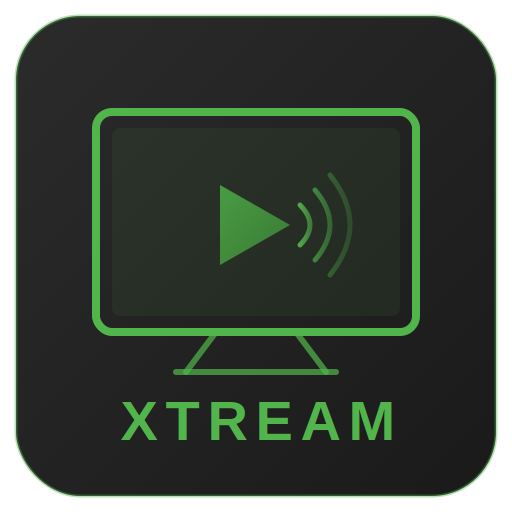

<p align="center">
  
</p>

<h1 align="center">Xtream Tuner</h1>

<p align="center">
  An Emby Server plugin for Xtream-compatible providers with Live TV, XMLTV guide support, movie and series STRM sync, metadata helpers, and a built-in admin dashboard.
</p>

<p align="center">
  
  
  
</p>

---

## What It Does

Xtream Tuner integrates directly with any Xtream-compatible IPTV provider. No Dispatcharr or external proxy is required.

### Live TV

- Generates an Emby-compatible M3U playlist from Xtream live streams
- Supports `ts` and `m3u8` live stream output formats
- Filters channels by selected categories
- Optionally hides adult channels
- Optionally includes category names as M3U `group-title` tags
- Cleans channel names before they reach Emby
- Keeps a warm channel cache so guide loads do not block on the provider every time

### Guide Data (EPG)

- Registered as a native Emby `IListingsProvider` — guide data flows through Emby's standard Live TV pipeline
- Supports three guide modes:
  - **Xtream server** — fetches XMLTV directly from the provider's `/xmltv.php` endpoint
  - **Custom XMLTV URL** — fetches from any XMLTV-compatible URL you supply
  - **Disabled** — no guide data fetched
- Caches the full XMLTV document in memory; cache TTL is configurable
- Each program is assigned a unique `ShowId` scoped to its channel, which prevents Emby from showing irrelevant "Other Showings" suggestions across unrelated channels

### Live Stream Playback

- Uses direct Xtream live URLs without a proxy layer
- Optional Live TV direct play toggle
- Runs `ffprobe` in the background on first tune to detect video codec, resolution, and audio codec
- Caches codec metadata per stream so Emby skips repeated probing on subsequent tunes — codec and resolution appear in the player OSD automatically
- Cache persists across Emby restarts; entries expire after 30 days and are re-probed automatically
- Exposes a Live TV settings action to clear the codec cache and trigger fresh probes
- Passes a custom HTTP `User-Agent` to provider requests when configured

### Movies

- Syncs VOD movies into `.strm` files
- Supports single-folder, per-category, and custom folder-mapping layouts
- Supports smart skip for already-correct files
- Supports orphan cleanup with a configurable safety threshold
- Supports TMDb folder naming like `Movie Name [tmdbid=123]`
- Supports TMDb fallback lookup through Emby's provider stack
- Optionally writes movie `.nfo` sidecars
- Supports trial sync previews for up to 30 movies
- Supports one-click deletion of synced movie content from the Movies tab

### Series

- Syncs Xtream series into `Show/Season XX/Episode.strm` folder structure
- Fetches per-series detail to build season and episode structure
- Cleans duplicate provider text out of episode titles
- Supports single-folder, per-category, and custom folder-mapping layouts
- Supports smart skip by timestamp and by episode-hash change detection
- Supports TVDb override mapping for specific shows
- Supports series folder naming with TVDb or TMDb IDs
- Supports TVDb fallback lookup through Emby's provider stack
- Optionally writes `tvshow.nfo`
- Supports trial sync previews for up to 30 series
- Supports one-click deletion of synced series content from the Series tab

### Dashboard And Configuration Page

- Built-in dashboard with sync status, history, and library counts
- Real-time progress for running sync jobs
- Retry flow for failed sync items
- Sanitized log download endpoint
- Auto-sync on an interval or at a daily clock time
- Manual cache refresh for M3U and EPG output
- Config page uses Emby's active theme accent color throughout — adapts automatically to any theme selected in Emby Display settings

---

## Installation

### Step 1: Download The Plugin

Download `Emby.Xtream.Plugin.dll` from the [latest release](../../releases/latest).

> Only the DLL is needed.

<details>
<summary><strong>Build from source</strong></summary>

Requires .NET SDK 6.0+:

```bash
git clone https://github.com/sftech13/EMBY-XC.git
cd EMBY-XC
dotnet build Emby.Xtream.Plugin/Emby.Xtream.Plugin.csproj -c Release
```

The compiled DLL will be at `Emby.Xtream.Plugin/bin/Release/netstandard2.0/Emby.Xtream.Plugin.dll`.

</details>

### Step 2: Install The Plugin

Copy `Emby.Xtream.Plugin.dll` to your Emby plugins directory and restart Emby.

**Docker**
```bash
docker cp Emby.Xtream.Plugin.dll emby:/config/plugins/
docker restart emby
```

**Linux**
```bash
sudo cp Emby.Xtream.Plugin.dll /var/lib/emby/plugins/
sudo systemctl restart emby-server
```

### Step 3: Configure Xtream Access

1. Open Emby.
2. Go to `Settings > Plugins > Xtream Tuner`.
3. Fill in:
   - `Server URL`
   - `Username`
   - `Password`
   - optional `HTTP User-Agent`
4. Click `Test Connection`.
5. Save.

### Step 4: Set Up Live TV

1. Open the `Live TV` tab.
2. Enable Live TV if needed.
3. Choose `ts` or `m3u8` output format.
4. Choose guide mode:
   - **Xtream server** — uses the provider's built-in XMLTV feed
   - **Custom XMLTV URL** — enter your own XMLTV endpoint
   - **Disabled** — no guide
5. Refresh categories and select the ones you want.
6. Optionally enable:
   - adult channels
   - direct play
   - M3U group-title tags
7. Save.
8. In Emby's Live TV settings, add the plugin as a tuner host.

> **Note:** Codec and resolution info appears in the player OSD after a channel's first tune. The plugin runs a background probe on first play and caches the result — subsequent tunes show full codec info immediately.

### Step 5: Set Up Movies Or Series Sync

1. Set `STRM Library Path`.
2. Enable Movies and/or Series.
3. Refresh categories.
4. Choose folder mode:
   - single
   - multiple
   - custom mappings
5. Optionally enable:
   - smart skip
   - orphan cleanup
   - NFO writing
   - TMDb/TVDb folder naming
   - metadata fallback lookup
6. Run a trial sync first if you want a preview.
7. Run the real sync.
8. Add the output folders as Emby libraries.

### Updating

Download the latest DLL from [Releases](../../releases/latest), replace the existing file, and restart Emby.

---

## Configuration Reference

| Setting | Default | Notes |
|---|---|---|
| `EnableLiveTv` | On | Enables the custom tuner host |
| `LiveTvOutputFormat` | `ts` | `ts` or `m3u8` |
| `EnableLiveTvDirectPlay` | On | Lets clients play the remote URL directly when possible |
| `EpgSource` | Xtream server | Xtream, custom URL, or disabled |
| `CustomEpgUrl` | empty | Used only in custom guide mode |
| `EpgCacheMinutes` | `30` | XMLTV cache TTL in minutes |
| `M3UCacheMinutes` | `15` | M3U cache TTL in minutes |
| `StrmLibraryPath` | `/config/xtream` | Base output path for Movies and Shows |
| `SmartSkipExisting` | On | Skips already-correct files during sync |
| `CleanupOrphans` | Off | Deletes provider-removed content from disk |
| `OrphanSafetyThreshold` | `20%` | Caps deletion percentage per cleanup pass |
| `EnableNfoFiles` | Off | Writes movie and show sidecar NFOs |
| `EnableTmdbFolderNaming` | Off | Adds `tmdbid` tags to movie folders |
| `EnableSeriesIdFolderNaming` | Off | Adds `tvdbid` or `tmdbid` tags to series folders |
| `EnableTmdbFallbackLookup` | Off | Uses Emby providers to find missing movie TMDb IDs |
| `EnableSeriesMetadataLookup` | Off | Uses Emby providers to find missing TVDb IDs |
| `AutoSyncEnabled` | Off | Enables scheduled sync runs |
| `AutoSyncMode` | `interval` | `interval` or `daily` |

---

## License

MIT
